# 🚀 SocialOSINTLM

## 📌 Overview
**SocialOSINTLM** is a powerful Python-based tool that aggregates and analyses user activity across multiple social media platforms, including **Twitter / X, Reddit, Hacker News, and Bluesky**. With AI-driven insights, it provides a comprehensive look into user engagement, trends, and media content.

## 🌟 Features
✅ Multi-platform data collection (Twitter, Reddit, Hacker News, Bluesky)  
✅ AI-powered analysis with OpenRouter API  
✅ Image analysis for media content  
✅ Cross-account comparison  
✅ Rate limit handling with informative feedback  
✅ Caching system for efficient data retrieval  
✅ Interactive CLI with rich formatting  
✅ Supports both interactive and programmatic usage  

```mermaid
flowchart TD
    %% Main nodes with styling
    A([Start SocialOSINTLM]) --> AA{{Setup Directories & API Clients}}
    AA --> B{Interactive or\nStdin Mode?}

    %% Interactive path with rounded rectangles and colors
    B -->|Interactive| C[/Display Platform Menu/]:::menuClass
    C --> D{Platform\nSelection}:::decisionClass
    D -->|Twitter| E1([Twitter]):::twitterClass
    D -->|Reddit| E2([Reddit]):::redditClass
    D -->|HackerNews| E3([HackerNews]):::hnClass
    D -->|Bluesky| E4([Bluesky]):::bskyClass
    D -->|Cross-Platform| E5([Multiple Platforms]):::multiClass

    %% Stdin path
    B -->|Stdin| F([Parse JSON Input]):::inputClass
    F --> G([Extract Platforms & Query]):::inputClass

    %% Analysis loop entry points
    E1 & E2 & E3 & E4 & E5 --> H([Enter Analysis Loop]):::loopClass
    G --> J([Run Analysis]):::analysisClass

    %% Command processing in analysis loop
    H -->|Query Input| I{Command\nType}:::decisionClass
    I -->|Analysis Query| J
    I -->|exit| Z([End Session]):::endClass
    I -->|refresh| Y([Force Refresh Cache]):::refreshClass
    Y --> H

    %% Data fetching with cache check
    J --> K{Cache\nAvailable?}:::cacheClass
    K -->|Yes| M([Load Cached Data]):::cacheClass
    K -->|No| L([Fetch Platform Data]):::apiClass

    %% Rate limiting subgraph
    subgraph API_Handling [API & Rate Limit Handling]
        direction TB
        L --> L1{Rate\nLimited?}:::errorClass
        L1 -->|Yes| L2([Handle Rate Limit]):::errorClass
        L2 --> L5([Abort or Retry]):::errorClass
        L1 -->|No| L3([Extract Text & URLs]):::dataClass
        L3 --> L4([Save to Cache]):::cacheClass
    end

    L4 --> M

    %% Parallel processing paths
    M --> N([Process Text Data]):::textClass
    M --> O([Process Media Data]):::mediaClass

    %% Media analysis subgraph
    subgraph Media_Analysis [Media Analysis Pipeline]
        direction TB
        O --> P([Download Media Files]):::mediaClass
        P --> Q([Image Analysis via LLM]):::llmClass
    end

    %% Text formatting and combining results
    N --> S([Format Platform Text]):::textClass
    Q --> R([Collect Media Analysis]):::mediaClass

    R & S --> T([Combine All Data]):::dataClass

    %% Final analysis and output
    T --> U([Call Analysis LLM with Query]):::llmClass
    U --> V([Format Analysis Results]):::outputClass

    V --> W([Display/Save Results]):::outputClass
    W --> H

    %% Custom styling with improved contrast
    classDef defaultClass fill:#FFFFFF,stroke:#333,stroke-width:1px,color:#000
    classDef menuClass fill:#BBDEFB,stroke:#0D47A1,stroke-width:2px,color:#000
    classDef decisionClass fill:#FFF9C4,stroke:#FBC02D,stroke-width:2px,color:#000
    classDef twitterClass fill:#1DA1F2,stroke:#0D47A1,stroke-width:2px,color:#FFF
    classDef redditClass fill:#FF5700,stroke:#8D2202,stroke-width:2px,color:#FFF
    classDef hnClass fill:#FF6600,stroke:#7F3300,stroke-width:2px,color:#FFF
    classDef bskyClass fill:#66BB6A,stroke:#1B5E20,stroke-width:2px,color:#FFF
    classDef multiClass fill:#4DB6AC,stroke:#004D40,stroke-width:2px,color:#FFF
    classDef inputClass fill:#E3F2FD,stroke:#1976D2,stroke-width:2px,color:#000
    classDef loopClass fill:#CE93D8,stroke:#6A1B9A,stroke-width:2px,color:#000
    classDef analysisClass fill:#BBDEFB,stroke:#1565C0,stroke-width:2px,color:#000
    classDef endClass fill:#FFCDD2,stroke:#C62828,stroke-width:2px,color:#000
    classDef refreshClass fill:#80CBC4,stroke:#004D40,stroke-width:2px,color:#000
    classDef cacheClass fill:#B2EBF2,stroke:#006064,stroke-width:2px,color:#000
    classDef apiClass fill:#C5E1A5,stroke:#33691E,stroke-width:2px,color:#000
    classDef errorClass fill:#E57373,stroke:#B71C1C,stroke-width:2px,color:#000
    classDef dataClass fill:#C8E6C9,stroke:#2E7D32,stroke-width:2px,color:#000
    classDef textClass fill:#90CAF9,stroke:#1565C0,stroke-width:2px,color:#000
    classDef mediaClass fill:#F48FB1,stroke:#AD1457,stroke-width:2px,color:#000
    classDef llmClass fill:#FFCC80,stroke:#EF6C00,stroke-width:2px,color:#000
    classDef outputClass fill:#F0F4C3,stroke:#827717,stroke-width:2px,color:#000

    %% Style all nodes with default class if not otherwise specified
    class A,AA,B defaultClass
```



## 🛠 Installation
### Prerequisites
Ensure you have **Python 3.8+** installed. Then, install the dependencies:

```sh
pip install -r requirements.txt
```

### Environment Variables
Set up the required API keys:
```sh
export TWITTER_BEARER_TOKEN='your_token_here'
export REDDIT_CLIENT_ID='your_client_id'
export REDDIT_CLIENT_SECRET='your_client_secret'
export REDDIT_USER_AGENT='your_user_agent'
export BLUESKY_IDENTIFIER='your_bluesky_handle'
export BLUESKY_APP_SECRET='your_bluesky_secret'
export OPENROUTER_API_KEY='your_openrouter_api_key'
export ANALYSIS_MODEL='your_preferred_model'  # OpenRouter-compatible model
export IMAGE_ANALYSIS_MODEL='your_preferred_model'  # OpenRouter-vision compatible model
```

## 🚀 Usage
### Interactive Mode
Run the script without arguments to start an interactive session:
```sh
python socialosimtlm.py
```
📌 Commands:
- Select platform(s) for analysis
- Enter usernames (comma-separated)
- Input analysis queries
- Type `refresh` to force data refresh
- Type `exit` to quit
- Type `help` to display available commands

### Programmatic Mode (Batch Processing)
You can provide input via JSON:
```sh
echo '{"platforms": {"twitter": ["user1"], "reddit": ["user2"]}, "query": "Analyse engagement", "format": "markdown"}' | python socialosintlm.py --stdin
```

### Command-line Arguments
- `--stdin` : Reads JSON input from standard input
- `--format [json|markdown]` : Specifies the output format

## 📊 Output
Results are saved in `data/outputs/` with timestamps:
- `analysis_YYYYMMDD_HHMMSS.md` for markdown
- `analysis_YYYYMMDD_HHMMSS.json` for JSON

## ⚡ Cache System
- Data cached in `data/cache/` for **24 hours**
- Media files stored in `data/media/`
- Format: `{platform}_{username}.json`

## 🔍 Error Handling
- **Rate limits**: Displays reset time and wait duration
- **API errors**: Detailed logs in `analyser.log`
- **Media handling**: Full download with proper authentication

## 🤖 AI Analysis
The tool uses OpenRouter API for:
- **Text Analysis**: Configurable via `ANALYSIS_MODEL` env var
- **Image Analysis**: Configurable via `IMAGE_ANALYSIS_MODEL` env var
- Image analysis automatically resizes large images and provides contextual insights

## 📸 Media Processing
- Downloads and stores media locally
- Supports JPEG, PNG, GIF, and WEBP formats
- Platform-specific authentication for media access
- Proper CDN handling for Bluesky images

## 🔒 Security
🔹 API keys required for all platforms  
🔹 Local caching of data  
🔹 Secure authentication for protected content  

## 🤝 Contributing
We welcome contributions! Feel free to submit pull requests or report issues.

## 📜 Licence
This project is licensed under the **MIT Licence**.
