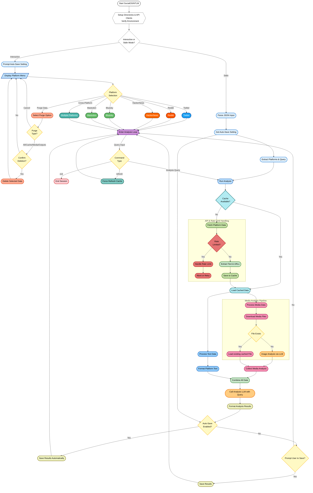

# 🚀 SocialOSINTLM

**SocialOSINTLM** is a powerful Python-based tool designed for Open Source Intelligence (OSINT) gathering and analysis. It aggregates and analyzes user activity across multiple social media platforms, including **Twitter / X, Reddit, Hacker News (via Algolia), Mastodon and Bluesky**. Leveraging AI through the OpenRouter API, it provides comprehensive insights into user engagement, content themes, behavioral patterns, and media content analysis.

## 🌟 Key Features

✅ **Multi-Platform Data Collection:** Aggregates data from Twitter/X, Reddit, Hacker News (via Algolia API), Mastodon and Bluesky

✅ **AI-Powered Analysis:** Utilises configurable models via the OpenRouter API for sophisticated text and image analysis

✅ **Structured AI Prompts:** Employs detailed system prompts for objective, evidence-based analysis focusing on behavior, semantics, interests, and communication style

✅ **Vision-Capable Image Analysis:** analyzes downloaded images (`JPEG, PNG, GIF, WEBP`) for OSINT insights using a vision-enabled LLM, focusing on objective details (setting, objects, people, text, activity)

✅ **Efficient Media Handling:** Downloads media, stores it locally, handles platform-specific authentication (Twitter Bearer, Bluesky JWT for CDN), processes Reddit galleries, and resizes large images (max 1024x1024) for analysis

✅ **Cross-Account Comparison:** analyze profiles across multiple selected platforms simultaneously

✅ **Intelligent Rate Limit Handling:** Detects API rate limits (especially detailed for Twitter, showing reset times), provides informative feedback, and prevents excessive requests. Raises `RateLimitExceededError`. Does not auto-rety.

✅ **Robust Caching System:** Caches fetched data for 24 hours (`data/cache/`) to reduce API calls and speed up subsequent analyzes. Media files are cached in `data/media/`

✅ **Purge data:** Purge option to clear all directories just cache, media or output.

✅ **Interactive CLI:** User-friendly command-line interface with rich formatting (`rich`) for platform selection, user input, and displaying results

✅ **Programmatic/Batch Mode:** Supports input via JSON from stdin for automated workflows (`--stdin`)

✅ **Configurable Fetch Limits:** Fetches a defined number of recent items per platform (e.g., 30 tweets, 20 Reddit submissions, 30 Reddit comments, 50 HN items, ~300 Bluesky posts) to balance depth and API usage

✅ **Detailed Logging:** Logs errors and operational details to `analyzer.log`

✅ **Environment Variable Configuration:** Easy setup using environment variables or a `.env` file



## 🛠 Installation

### Prerequisites
*   **Python 3.8+**
*   Pip (Python package installer)

### Steps
1.  **Clone the repository (if you haven't already):**
    ```bash
    git clone https://github.com/bm-github/SocialOSINTLM.git
    cd SocialOSINTLM
    ```
2.  **Install dependencies:**
    ```bash
    pip install -r requirements.txt
    ```
3.  **Set up Environment Variables:**
    Create a `.env` file in the project root or export the following environment variables:

    ```sh
    # --- Platform API Keys ---
    # Twitter/X (Requires Elevated/Academic access for user tweet lookups)
    export TWITTER_BEARER_TOKEN='your_twitter_v2_bearer_token'

    # Reddit (Create an app at https://www.reddit.com/prefs/apps)
    export REDDIT_CLIENT_ID='your_reddit_client_id'
    export REDDIT_CLIENT_SECRET='your_reddit_client_secret'
    export REDDIT_USER_AGENT='YourAppName/1.0 by YourUsername' # Customise this

    # Bluesky (Generate an App Password in Bluesky settings)
    export BLUESKY_IDENTIFIER='your-handle.bsky.social' # Your full Bluesky handle
    export BLUESKY_APP_SECRET='xxxx-xxxx-xxxx-xxxx' # Your generated App Password

    # Mastodon (Generate an App Password in Bluesky settings)
    export MASTODON_API_BASE_URL='https://mastodon.example' # Your Mastodon server
    export MASTODON_ACCESS_TOKEN='your_access_token'


    # --- AI Analysis API ---
    # OpenRouter (Get API Key from https://openrouter.ai)
    export OPENROUTER_API_KEY='your_openrouter_api_key'

    # --- AI Model Selection (OpenRouter Compatible) ---
    # Model for text analysis
    export ANALYSIS_MODEL='google/gemini-2.0-flash-001'
    # Vision-capable model for image analysis
    export IMAGE_ANALYSIS_MODEL='openai/gpt-4o-mini' # Must support vision
    ```
    *Note: The script automatically loads variables from a `.env` file if present.*

## 🚀 Usage

### Interactive Mode
Run the script without arguments to start the interactive CLI session:
```bash
python socialosintlm.py
```
1.  You'll be prompted to select platform(s).
2.  Enter the username(s) for each selected platform (comma-separated if multiple).
    *   **Twitter:** Usernames *without* the leading `@`.
    *   **Reddit:** Usernames *without* the leading `u/`.
    *   **Hacker News:** Usernames as they appear.
    *   **Bluesky:** Full handles including `.bsky.social` (or custom domain).
    *   **Mastodon:** Full handles including `.mastodon.social` (or custom domain).
3.  Once platforms/users are selected, you enter an analysis loop for that session. Enter your analysis queries (e.g., "analyze recent activity patterns", "Identify key interests", "Assess communication style").
4.  **Commands within the analysis loop:**
    *   `refresh`: Clears the cache for the current users/platforms and fetches fresh data.
    *   `help`: Displays available commands.
    *   `exit`: Exits the current analysis session and returns to the platform selection menu.
    *   Press `Ctrl+C` to potentially exit the program (will prompt for confirmation).

### Programmatic Mode (via Stdin)
Provide input as a JSON object via standard input using the `--stdin` flag. This is useful for scripting or batch processing.

```bash
        echo '{
        "platforms": {
        "twitter": ["user1", "user2"],
        "reddit": ["user3"],
        "hackernews": ["user4"],
        "bluesky": ["handle1.bsky.social"],
        "mastodon": ["user@instance.social", "another@other.server"]
        },
        "query": "Analyze communication style and main topics."
        }' | python socialosintlm.py --stdin
```

### Command-line Arguments
*   `--stdin`: Read analysis configuration from standard input as a JSON object.
*   `--format [json|markdown]`: Specifies the output format when saving results (default: `markdown`). Also affects output format in `--stdin` mode if not specified in the JSON.

## 📊 Output
*   Analysis results are displayed in the console (in interactive mode).
*   Results are automatically saved to the `data/outputs/` directory.
*   Filename format: `analysis_YYYYMMDD_HHMMSS.[md|json]` (based on the `--format` argument or JSON input).

## ⚡ Cache System
*   **Text/API Data:** Fetched platform data is cached for **24 hours** in `data/cache/` as JSON files (`{platform}_{username}.json`). This minimizes redundant API calls.
*   **Media Files:** Downloaded images and media are stored in `data/media/` using hashed filenames (`{platform}_{username}_{url_hash}.jpg`). These are not automatically purged by the 24-hour cache expiry but are reused if the same URL is encountered.
*   Use the `refresh` command in interactive mode to force a bypass of the cache for the current session.

## 🔍 Error Handling & Logging
*   **Rate Limits:** Detects API rate limits. For Twitter, it attempts to display the reset time and estimated wait duration. For others, it provides a general rate limit message. The specific `RateLimitExceededError` is raised internally.
*   **API Errors:** Handles common platform-specific errors (e.g., user not found (`tweepy.NotFound`), forbidden access (`tweepy.Forbidden`), general request issues (`prawcore.exceptions.RequestException`, `exceptions.AtProtocolError`)).
*   **Media Download Errors:** Logs issues during media download or processing.
*   **Logging:** Detailed errors and warnings are logged to `analyzer.log` for debugging.

## 🤖 AI Analysis Details
*   **Text Analysis:**
    *   Uses the model specified by `ANALYSIS_MODEL`.
    *   Receives **formatted summaries** of fetched data (user info, stats, recent post/comment text snippets, media presence indicators) per platform, *not* raw API dumps.
    *   Guided by a detailed **system prompt** focusing on objective, evidence-based analysis across domains: Behavioral Patterns, Semantic Content, Interests/Network, Communication Style.
*   **Image Analysis:**
    *   Uses the vision-capable model specified by `IMAGE_ANALYSIS_MODEL`.
    *   Images larger than 1024x1024 are resized before analysis to conserve tokens and meet potential API limits.
    *   Guided by a specific **prompt** requesting objective identification of key OSINT-relevant elements (setting, objects, people details, text, activity, overall theme). Avoids speculation.
*   **Integration:** The final text analysis incorporates insights derived from both the formatted text data summaries and the individual image analysis reports.

## 📸 Media Processing Details
*   Downloads media files (currently focused on images: `JPEG, PNG, GIF, WEBP`) linked in posts/tweets.
*   Stores files locally in `data/media/`.
*   Handles platform-specific access:
    *   Twitter: Uses Bearer Token for potential private media access (though typically public URLs).
    *   Bluesky: Constructs authenticated CDN URLs (`cdn.bsky.app`) using the user's DID, image CID, and the session's access token.
    *   Reddit: Handles direct image links and images within Reddit Galleries (`media_metadata`).
*   analyzes valid downloaded images using the vision LLM.

## 🔒 Security Considerations
*   **API Keys:** Requires potentially sensitive API keys and secrets stored as environment variables or in a `.env` file. Ensure this file is secured and added to `.gitignore`.
*   **Data Caching:** Fetched data and downloaded media are stored locally in the `data/` directory. Be mindful of the sensitivity of the data being analyzed and secure the directory appropriately.
*   **Terms of Service:** Ensure your use of the tool complies with the Terms of Service of each social media platform and the OpenRouter API. Automated querying can be subject to restrictions.

## 🤝 Contributing
Contributions are welcome! Please feel free to submit pull requests, report issues, or suggest enhancements via the project's issue tracker.

## 📜 License
This project is licensed under the **MIT License**. See the `LICENSE` file for details.
