# 🚀 SocialOSINTLM

**SocialOSINTLM** is a powerful Python-based tool designed for Open Source Intelligence (OSINT) gathering and analysis. It aggregates and analyzes user activity across multiple social media platforms, including **Twitter / X, Reddit, Hacker News (via Algolia), Mastodon, and Bluesky**. Leveraging AI through the OpenRouter API, it provides comprehensive insights into user engagement, content themes, behavioral patterns, and media content analysis.

## 🌟 Key Features

✅ **Multi-Platform Data Collection:** Aggregates data from Twitter/X, Reddit, Hacker News (via Algolia API), Mastodon, and Bluesky.

✅ **AI-Powered Analysis:** Utilises configurable models via the OpenRouter API for sophisticated text and image analysis. AI calls are threaded for a responsive UI.

✅ **Structured AI Prompts:** Employs detailed system prompts for objective, evidence-based analysis focusing on behavior, semantics, interests, communication style, and visual data integration.

✅ **Vision-Capable Image Analysis:** Analyzes downloaded images (`JPEG, PNG, GIF, WEBP`) for OSINT insights using a vision-enabled LLM.
    *   Focuses on objective details: setting, objects, people, text, activity.
    *   Advanced Preprocessing: Handles animated GIFs (first frame), converts various image modes (e.g., RGBA, Palette) to RGB, and resizes large images (max dimension 1536px) using high-quality resampling for optimal analysis.

✅ **Efficient Media Handling:**
    *   Downloads media, stores it locally with content-hashed filenames.
    *   Handles platform-specific authentication for media access where needed (e.g., Twitter Bearer, Bluesky JWT for CDN).
    *   Processes Reddit galleries and Mastodon/Bluesky media attachments.

✅ **Cross-Account Analysis:** Analyzes profiles across multiple selected platforms simultaneously, providing data to the LLM for potential comparative insights.

✅ **Intelligent Rate Limit Handling:** Detects API rate limits (especially detailed for Twitter, showing reset times), provides informative feedback, and raises `RateLimitExceededError`.

✅ **Robust Caching System:**
    *   Caches fetched text/metadata for 24 hours in `data/cache/` to reduce API calls. Data is sorted chronologically before caching.
    *   Media files are cached indefinitely in `data/media/`.
    *   Improved interactive data purging options.

✅ **Interactive CLI:** User-friendly command-line interface with rich formatting (`rich`) for platform selection, user input (including assisted Mastodon username entry), and displaying results. Progress indicators for data fetching and AI analysis.

✅ **Programmatic/Batch Mode:** Supports input via JSON from stdin for automated workflows (`--stdin`) with improved error handling and exit codes. Respects `--no-auto-save` and `--format` arguments.

✅ **Configurable Fetch Limits:** Uses defined constants (`INITIAL_FETCH_LIMIT`, `INCREMENTAL_FETCH_LIMIT`, `MASTODON_FETCH_LIMIT`) for fetching recent items per platform to balance depth and API usage.

✅ **Detailed Logging:** Logs errors and operational details to `analyzer.log`. Log level configurable via `--log-level`.

✅ **Environment Variable Configuration:** Easy setup using environment variables or a `.env` file.

```mermaid
flowchart TD
    %% Initialization
    A([Start SocialOSINTLM]) --> AA{{Setup Directories & API Clients
    Verify Environment}}:::setupClass

    %% Mode Selection
    AA --> B{Interactive or
    Stdin Mode?}:::decisionClass

    %% Interactive Mode Path
    B -->|Interactive| B1([Prompt Auto-Save Setting]):::inputClass
    B1 --> C[/Display Platform Menu/]:::menuClass
    C --> D{Platform
    Selection}:::decisionClass

    %% Platform-Specific Branches
    D -->|Twitter| E1([Twitter]):::twitterClass
    D -->|Reddit| E2([Reddit]):::redditClass
    D -->|HackerNews| E3([HackerNews]):::hnClass
    D -->|Bluesky| E4([Bluesky]):::bskyClass
    D -->|Mastodon| E5([Mastodon]):::MastodonClass
    D -->|Cross-Platform| E6([Multiple Platforms]):::multiClass

    %% Stdin Mode Path
    B -->|Stdin| F([Parse JSON Input]):::inputClass
    F --> GA([Get Auto-Save Setting]):::inputClass
    GA --> G([Extract Platforms & Query]):::inputClass

    %% Analysis Loop Entry Points
    E1 & E2 & E3 & E4 & E5 & E6--> H([Enter Analysis Loop]):::loopClass
    G --> J([Run Analysis]):::analysisClass

    %% Command Processing in Analysis Loop
    H -->|Query Input| I{Command
    Type}:::decisionClass
    I -->|Analysis Query| J
    I -->|exit| Z([End Session]):::endClass
    I -->|refresh| Y([Force Refresh Cache]):::refreshClass
    Y --> H

    %% Data Fetching and Caching
    J --> K{Cache
    Available?}:::cacheClass
    K -->|Yes| M([Load Cached Data]):::cacheClass
    K -->|No| L([Fetch Platform Data]):::apiClass

    %% API & Rate Limit Handling Subgraph
    subgraph API_Handling [API & Rate Limit Handling]
        direction TB
        L --> L1{Rate
        Limited?}:::errorClass
        L1 -->|Yes| L2([Handle Rate Limit]):::errorClass
        L2 --> L5([Abort Fetch Attempt]):::errorClass
        L1 -->|No| L3([Extract Text & URLs]):::dataClass
        L3 --> L4([Save to Cache]):::apiClass
    end

    L4 --> M

    %% Parallel Processing Paths
    M --> N([Process Text Data]):::textClass
    M --> O([Process Media Data]):::mediaClass

    %% Media Analysis Pipeline Subgraph
    subgraph Media_Analysis [Media Analysis Pipeline]
        direction TB
        O --> P([Download Media Files]):::mediaClass
        P --> PA{File Exists}:::decisionClass
        PA -->|Yes| Q1([Load existing cached File]):::mediaClass
        PA -->|No| Q([Image Analysis via LLM]):::llmClass

    end
    Q --> R([Collect Media Analysis]):::mediaClass
    Q1 --> R

    %% Text Formatting and Combining Results
    N --> S([Format Platform Text]):::textClass

    R & S --> T([Combine All Data]):::dataClass

    %% Final Analysis and Output
    T --> U([Call Analysis LLM with Query]):::llmClass
    U --> V([Format Analysis Results]):::outputClass
     %% Auto-Save Decision
    V --> V1{Auto-Save
    Enabled?}:::decisionClass

    %% Handle Saving
    V1 -->|Yes| WA([Save Results Automatically]):::outputClass
    WA --> H
    V1 -->|No| WB{Prompt User to Save?}:::decisionClass
    WB --> |Yes|WC([Save Results]):::outputClass
    WC --> H
    WB --> |No| H

    %% Result display for each save option
    %% Result display for each save option
    GA --> V1
    %% Custom Styling
    classDef defaultClass fill:#FFFFFF,stroke:#333,stroke-width:1px,color:#000
    classDef menuClass fill:#BBDEFB,stroke:#0D47A1,stroke-width:2px,color:#000
    classDef decisionClass fill:#FFF9C4,stroke:#FBC02D,stroke-width:2px,color:#000
    classDef twitterClass fill:#1DA1F2,stroke:#0D47A1,stroke-width:2px,color:#FFF
    classDef redditClass fill:#FF5700,stroke:#8D2202,stroke-width:2px,color:#FFF
    classDef hnClass fill:#FF6600,stroke:#7F3300,stroke-width:2px,color:#FFF
    classDef bskyClass fill:#66BB6A,stroke:#1B5E20,stroke-width:2px,color:#FFF
    classDef MastodonClass fill:#66BB6A,stroke:#1B5E20,stroke-width:2px,color:#FFF
    classDef multiClass fill:#4DB6AC,stroke:#004D40,stroke-width:2px,color:#FFF
    classDef inputClass fill:#E3F2FD,stroke:#1976D2,stroke-width:2px,color:#000
    classDef loopClass fill:#CE93D8,stroke:#6A1B9A,stroke-width:2px,color:#000
    classDef analysisClass fill:#BBDEFB,stroke:#1565C0,stroke-width:2px,color:#000
    classDef endClass fill:#FFCDD2,stroke:#C62828,stroke-width:2px,color:#000
    classDef refreshClass fill:#80CBC4,stroke:#004D40,stroke-width:2px,color:#000
    classDef cacheClass fill:#B2EBF2,stroke:#006064,stroke-width:2px,color:#000
    classDef apiClass fill:#C5E1A5,stroke:#33691E,stroke-width:2px,color:#000
    classDef errorClass fill:#E57373,stroke:#B71C1C,stroke-width:2px,color:#000
    classDef dataClass fill:#C8E6C9,stroke:#2E7D32,stroke-width:2px,color:#000
    classDef textClass fill:#90CAF9,stroke:#1565C0,stroke-width:2px,color:#000
    classDef mediaClass fill:#F48FB1,stroke:#AD1457,stroke-width:2px,color:#000
    classDef llmClass fill:#FFCC80,stroke:#EF6C00,stroke-width:2px,color:#000
    classDef outputClass fill:#F0F4C3,stroke:#827717,stroke-width:2px,color:#000
    classDef setupClass fill:#D1C4E9,stroke:#4527A0,stroke-width:2px,color:#000

    %% Style all nodes with default class if not otherwise specified
    class A,AA,B defaultClass
```



## 🛠 Installation

### Prerequisites
*   **Python 3.8+**
*   Pip (Python package installer)

### Steps
1.  **Clone the repository (if you haven't already):**
    ```bash
    git clone https://github.com/bm-github/SocialOSINTLM.git
    cd SocialOSINTLM
    ```
2.  **Install dependencies:**
    ```bash
    pip install -r requirements.txt
    ```
3.  **Set up Environment Variables:**
    Create a `.env` file in the project root or export the following environment variables:

    ```sh
    # --- Core AI Analysis API ---
    # OpenRouter (Get API Key from https://openrouter.ai)
    export OPENROUTER_API_KEY='your_openrouter_api_key'

    # --- AI Model Selection (OpenRouter Compatible) ---
    # Model for text analysis (e.g., Mistral, Llama, Gemini models)
    export ANALYSIS_MODEL='mistralai/mixtral-8x7b-instruct'
    # Vision-capable model for image analysis
    export IMAGE_ANALYSIS_MODEL='google/gemini-pro-vision' # Or e.g., openai/gpt-4-vision-preview

    # --- Platform API Keys (Configure at least one platform or use Hacker News) ---
    # Twitter/X (Requires Elevated/Academic access for user tweet lookups)
    export TWITTER_BEARER_TOKEN='your_twitter_v2_bearer_token'

    # Reddit (Create an app at https://www.reddit.com/prefs/apps)
    export REDDIT_CLIENT_ID='your_reddit_client_id'
    export REDDIT_CLIENT_SECRET='your_reddit_client_secret'
    export REDDIT_USER_AGENT='YourAppName/1.0 by YourUsername' # Customise this

    # Bluesky (Generate an App Password in Bluesky settings)
    export BLUESKY_IDENTIFIER='your-handle.bsky.social' # Your full Bluesky handle
    export BLUESKY_APP_SECRET='xxxx-xxxx-xxxx-xxxx' # Your generated App Password

    # Mastodon (Create an app in your Mastodon instance's Preferences -> Development)
    export MASTODON_API_BASE_URL='https://mastodon.social' # Your Mastodon instance URL
    export MASTODON_ACCESS_TOKEN='your_mastodon_access_token'
    ```
    *Note: The script automatically loads variables from a `.env` file if present.*

## 🚀 Usage

### Interactive Mode
Run the script without arguments to start the interactive CLI session:
```bash
python socialosintlm.py
```
1.  You'll be prompted to select platform(s) or `purge data`.
2.  Enter the username(s) for each selected platform (comma-separated if multiple).
    *   **Twitter:** Usernames *without* the leading `@`.
    *   **Reddit:** Usernames *without* the leading `u/`.
    *   **Hacker News:** Usernames as they appear.
    *   **Bluesky:** Full handles including `.bsky.social` (or custom domain).
    *   **Mastodon:** Full handles in `user@instance.domain` format. If the instance part is omitted and `MASTODON_API_BASE_URL` is set, the tool will offer to use that instance.
3.  Once platforms/users are selected, you enter an analysis loop for that session. Enter your analysis queries (e.g., "analyze recent activity patterns", "Identify key interests", "Assess communication style").
4.  **Commands within the analysis loop:**
    *   `refresh`: Clears the cache for the current users/platforms and fetches fresh data.
    *   `help`: Displays available commands.
    *   `exit`: Exits the current analysis session and returns to the platform selection menu.
    *   Press `Ctrl+C` to potentially exit the program (will prompt for confirmation).

### Programmatic Mode (via Stdin)
Provide input as a JSON object via standard input using the `--stdin` flag. This is useful for scripting or batch processing.

```bash
echo '{
  "platforms": {
    "twitter": ["user1", "user2"],
    "reddit": ["user3"],
    "hackernews": ["user4"],
    "bluesky": ["handle1.bsky.social"],
    "mastodon": ["user@instance.social", "another@other.server"]
  },
  "query": "Analyze communication style and main topics."
}' | python socialosintlm.py --stdin
```

### Command-line Arguments
*   `--stdin`: Read analysis configuration from standard input as a JSON object.
*   `--format [json|markdown]`: Specifies the output format when saving reports (default: `markdown`).
    *   `markdown`: Saves as a `.md` file with YAML frontmatter.
    *   `json`: Saves as a `.json` file containing metadata and the Markdown report content.
*   `--no-auto-save`: Disables automatic saving of reports.
    *   Interactive mode: Prompts the user before saving.
    *   Stdin mode: Prints the report directly to stdout instead of saving.
*   `--log-level [DEBUG|INFO|WARNING|ERROR|CRITICAL]`: Sets the logging level (default: `WARNING`).

## 📊 Output
*   Analysis results are displayed in the console with Rich formatting (in interactive mode).
*   By default, results are automatically saved to the `data/outputs/` directory (unless `--no-auto-save` is used).
*   Filename format: `analysis_YYYYMMDD_HHMMSS_{platforms}_{query_snippet}.[md|json]`.
*   JSON output includes structured metadata and the full Markdown report.

## ⚡ Cache System
*   **Text/API Data:** Fetched platform data is cached for **24 hours** in `data/cache/` as JSON files (`{platform}_{sanitized_username}.json`). This minimizes redundant API calls. Data is sorted chronologically before caching.
*   **Media Files:** Downloaded images and media are stored in `data/media/` using content-hashed filenames (e.g., `{url_hash}.jpg`). These are reused if the same URL is encountered.
*   Use the `refresh` command in interactive mode to force a bypass of the cache for the current session.
*   Use the `purge data` option in the main menu for interactive removal of cached data.

## 🔍 Error Handling & Logging
*   **Rate Limits:** Detects API rate limits. For Twitter, it attempts to display the reset time. For others, it provides a general rate limit message. The specific `RateLimitExceededError` is raised internally and handled.
*   **API Errors:** Handles common platform-specific errors (e.g., user not found, forbidden access, general request issues) with clear logging and user feedback.
*   **Media Download/Processing Errors:** Logs issues during media download, processing, or analysis.
*   **Logging:** Detailed errors and warnings are logged to `analyzer.log`. The log level can be set via the `--log-level` argument.
*   **STDIN Mode Exit Codes:** `0` for success, `1` for input/setup errors, `2` for errors during the analysis phase.

## 🤖 AI Analysis Details
*   **Text Analysis:**
    *   Uses the model specified by `ANALYSIS_MODEL`.
    *   Receives **formatted summaries** of fetched data (user info, stats, recent post/comment text snippets, media presence indicators, platform-specific details like Mastodon visibility/CWs or Bluesky languages) per platform.
    *   Guided by a detailed **system prompt** focusing on objective, evidence-based analysis across domains: Behavioral Patterns, Semantic Content, Interests/Network, Communication Style, Visual Data Integration.
*   **Image Analysis:**
    *   Uses the vision-capable model specified by `IMAGE_ANALYSIS_MODEL`.
    *   Images are preprocessed: animated GIFs use the first frame, various modes converted to RGB, and images resized if max dimension exceeds **1536px**.
    *   Guided by a specific **prompt** requesting objective identification of key OSINT-relevant elements (setting, objects, people details, text, activity, overall theme). Avoids speculation.
*   **Integration:** The final text analysis incorporates insights derived from both the formatted text data summaries and the individual image analysis reports (if available).

## 📸 Media Processing Details
*   Downloads media files (images: `JPEG, PNG, GIF, WEBP`; also handles video/audio types by downloading, though analysis is image-focused) linked in posts/tweets.
*   Stores files locally in `data/media/` with content-hashed names.
*   Handles platform-specific access:
    *   Twitter: May use Bearer Token for media URLs.
    *   Bluesky: Constructs authenticated CDN URLs (`cdn.bsky.app`) using the user's DID, image CID, and the session's access token.
    *   Reddit: Handles direct image links and images within Reddit Galleries (`media_metadata`).
    *   Mastodon: Media usually public CDN, but downloads standard attachments.
*   Analyzes valid downloaded images using the vision LLM.

## 🔒 Security Considerations
*   **API Keys:** Requires potentially sensitive API keys and secrets stored as environment variables or in a `.env` file. Ensure this file is secured and added to `.gitignore`.
*   **Data Caching:** Fetched data and downloaded media are stored locally in the `data/` directory. Be mindful of the sensitivity of the data being analyzed and secure the directory appropriately.
*   **Terms of Service:** Ensure your use of the tool complies with the Terms of Service of each social media platform and the OpenRouter API. Automated querying can be subject to restrictions.

## 🤝 Contributing
Contributions are welcome! Please feel free to submit pull requests, report issues, or suggest enhancements via the project's issue tracker.

## 📜 License
This project is licensed under the **MIT License**. See the `LICENSE` file for details.